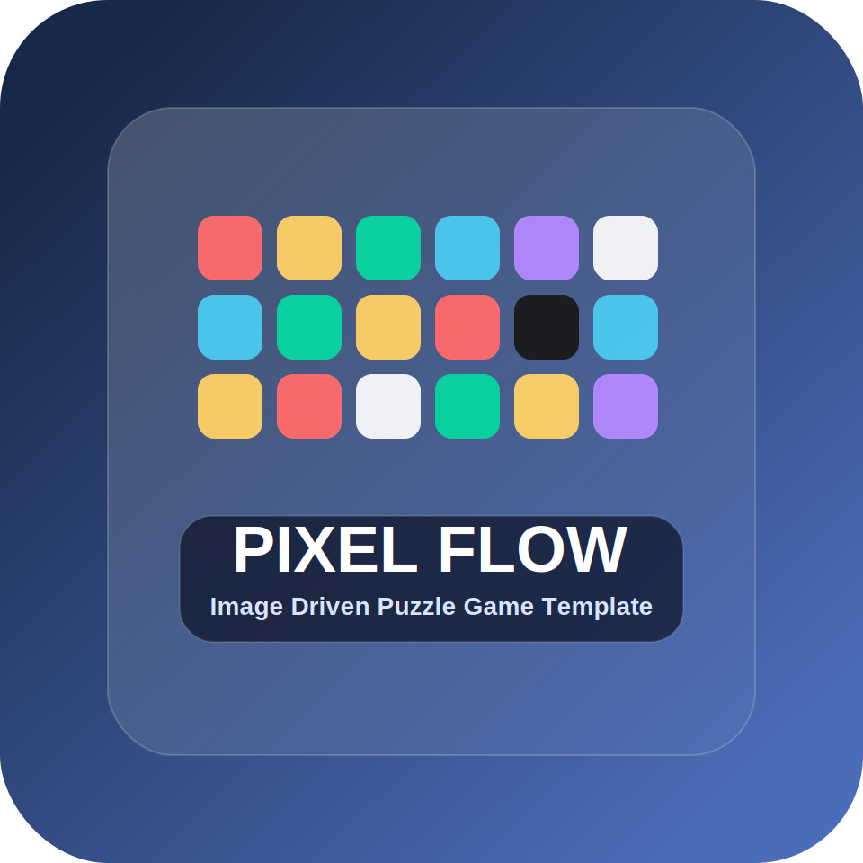

# Pixel Flow | Image Driven Puzzle Game Template

  

**Pixel Flow** is a plug and play Unity template for building image driven color matching puzzle games.

Import artwork, turn it into a playable block board, generate a matching pig queue, and ship a polished puzzle loop without rebuilding the core gameplay stack from scratch.

---

## Gameplay Preview

  <video src="README_ASSETS/Movie_004.mp4" poster="README_ASSETS/Level Editor 3.jpg" controls muted playsinline width="70%">
    Your browser does not support the video tag.
  </video>

> The README is currently using `README_ASSETS/Movie_004.mp4`. If your repo host does not render inline video, replace this block with a GIF using the same section layout.

---

## Screenshots

  

---

## Features

### Core Gameplay
- Conveyor based dispatch loop
- Tap to send pigs from the holding tray onto the belt
- Automatic color matching target selection
- Ammo based pig system with win and fail states
- Smooth dispatch, firing, return, and deplete animations

### Level Creation Workflow
- Import PNG artwork directly into a playable grid
- Adaptive color mapping into the Pixel Flow palette
- Manual painting and obstacle placement in the custom level editor
- Auto generated pig queue based on exposed block layers
- Guaranteed completion validator for queue sanity checks

### Customization
- ScriptableObject driven level database
- Theme database with environment prefab support
- Block tone variation through atlas based visuals
- Configurable ammo rules, holding slot count, and board density
- Easy expansion for new visuals, rules, or puzzle variants

### Production Ready Setup
- 8 sample levels included
- 16 imported sample source images included
- Mobile and desktop pointer input support
- Object pooling, audio hooks, and tweened runtime feedback
- Single scene bootstrap with modular runtime composition

---

## How It Works

1. Import a source image or paint the board manually inside the level editor.
2. Convert the artwork into color matched blocks on a gameplay grid.
3. Generate or edit the pig queue that will clear the exposed layers.
4. Tap pigs into the conveyor flow and clear the entire board to complete the level.

No custom scene setup is required to start building levels.

---

## Editor Workflow

  
  

- Open `Tools > Pixel Flow > Level Editor`
- Select `PixelFlowLevelDatabase`
- Import an image or build the level by hand
- Tune import settings, palette, queue rules, and holding slots
- Save and press Play in `Assets/Scenes/GameScene.unity`

---

## Easy To Extend

You can:

- Add new block types and obstacles
- Change queue generation rules
- Replace pigs with a different character set
- Add boosters, blockers, or special shots
- Expand the theme database with new environments

---

## Quick Start

1. Open `Assets/Scenes/GameScene.unity`
2. Open `Tools > Pixel Flow > Level Editor`
3. Pick or create a level in `PixelFlowLevelDatabase`
4. Import artwork or place blocks manually
5. Save, press Play, and tune the queue flow

---

## SEO Keywords

unity puzzle template, image based puzzle unity, color matching puzzle template, pixel art puzzle unity, unity level editor template, scriptableobject level database, mobile puzzle game unity, conveyor puzzle game template

---

## Contact and Support

Use this section for your store page email, Discord, or support form.
